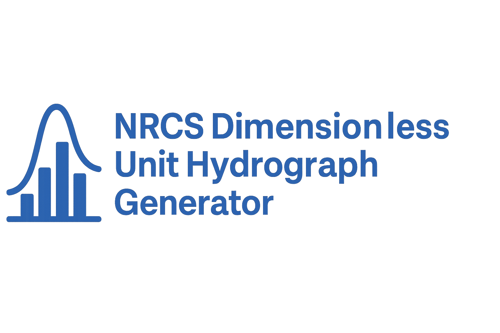

# NRCS Dimensionless Unit Hydrograph Generator

<p align="center">
  
</p>

---

## 🚀 Overview

The **NRCS Dimensionless Unit Hydrograph Generator** is an interactive web application for generating synthetic hydrographs based on user-defined watershed and rainfall conditions. Built on the widely accepted NRCS DUH methodology, this tool is ideal for simulating runoff from ungaged basins across a range of Annual Exceedance Probabilities (AEPs).

---

## ✨ Features

- 🔢 **Multiple AEPs**: Supports 1, 2, 5, 10, 25, 50, 100, 200, 500, and 1000-year events  
- 📊 **Interactive Visualization**: Dynamic, responsive hydrograph plots using Plotly  
- 💧 **Flexible Units**: View flows in cubic feet per second (CFS) or cubic meters per second (m³/s)  
- 📁 **CSV Export**: Save calculated hydrographs for further analysis  
- 🧠 **Transparent Calculations**: Displays all key time parameters  
- 💻 **Web Interface**: Clean, user-friendly Streamlit app  


### 📺 Click the image below to watch 5-min tutorial on how to install and use the NRCS DUH tool:

<a href="https://youtu.be/VmRRUMsureQ?si=S1H3Y5KVb6yU4Bdl" target="_blank">
  
</a>


---

## 🧪 Methodology

This application applies the NRCS Dimensionless Unit Hydrograph approach, expressing the normalized flow rate \( Q/Q_p \) as a function of normalized time \( t/T_p \), where:

- ($Q_p$): peak runoff rate
- ($T_p$): time to peak from rainfall excess
- ($m$): gamma distribution shape factor (typically 3.7)

The hydrograph formula used is:

$$
\frac{Q}{Q_p} = \left( \frac{t}{T_p} \cdot e^{1 - \frac{t}{T_p}} \right)^m
$$


- Time Lag ($t_{lag}$):
  - CN-based: $t_{lag} = 1.362 \times 10^{-3} \cdot \left(\frac{1000}{CN} - 9 \right)^{0.7} \cdot \frac{L^{0.8}}{\sqrt{S_0}}$
  - S-based: $t_{lag} = 1.362 \times 10^{-3} \cdot \left(\frac{S}{25.4} + 1 \right)^{0.7} \cdot \frac{L^{0.8}}{\sqrt{S_0}}$
- Time of Concentration: $t_c = \frac{t_{lag}}{0.6}$
- Rainfall Duration: $t_r = 0.133 \cdot t_c$
- Time to Peak: $T_p = 0.5 \cdot t_r + t_{lag}$

Conditions are validated against:
$t_r \leq 0.2 \cdot t_c \quad \textrm{or} \quad t_r \leq 0.3 \cdot T_p$

---

## 📦 Installation

### Option 1: Clone This Repo
```bash
git clone https://github.com/mohsennasab/NRCS_DUH.git
cd NRCS_DUH
```

### Option 2: Download ZIP
- Download and extract from GitHub directly

### Set Up a Virtual Environment (Recommended)
```bash
python -m venv nrcs_duh
# Activate:
# Windows
nrcs_duh\Scripts\activate
# Mac/Linux
source nrcs_duh/bin/activate

# Install dependencies
pip install streamlit==1.41.1 pandas==1.5.3 numpy==1.26.4 plotly==5.15.0
```

---

## ▶️ How to Run

### Run the app
```bash
python run_app.py
```

### Or launch with Streamlit directly
```bash
streamlit run streamlit_app.py --server.port=8888
```

---

## 🧑‍💻 Usage

1. Choose your calculation method (Curve Number or S-based)
2. Enter watershed parameters:
   - Area (sq mi), Curve Number (CN) or Storage (S), average slope, time interval
3. Input known peak flows for selected AEPs
4. Click **"Generate Hydrographs"**
5. Explore:
   - 🌊 **Hydrograph Plot**
   - 📋 **Tabular Data** (with download)
   - 🧠 **Time Parameters**

---

## 📁 Project Structure

| File                | Description                                    |
|---------------------|------------------------------------------------|
| `streamlit_app.py`  | Main Streamlit interface                       |
| `nrcs_calculator.py`| Core hydrograph generation logic               |
| `run_app.py`        | Launch script                                  |
| `Images/`           | Contains app logo and graphics                 |
| `README.md`         | This file 🚀                                   |

---

## 📚 References

- [NRCS Chapter 16 – Hydrographs (PDF)](https://directives.nrcs.usda.gov/sites/default/files2/1720461096/Chapter%2016%20-%20Hydrographs.pdf)  
- [NOAA Unit Hydrograph Manual](https://www.nohrsc.noaa.gov/technology/gis/uhg_manual.html)

---

## 🛠️ Troubleshooting

- **Port already in use?** The app auto-detects the next available port  
- **Streamlit not found?** Run `pip install streamlit==1.41.1`  
- **No browser?** Manually visit `http://localhost:8888`  
- **Permission denied?** Try running with `sudo` (Linux/macOS) or as admin (Windows)

---

## 👨‍💻 Author

Created by [Mohsen Tahmasebi Nasab, PhD](https://www.hydromohsen.com)

---

<p align="center"><em>© 2025 | NRCS Hydrograph Generator</em></p>
